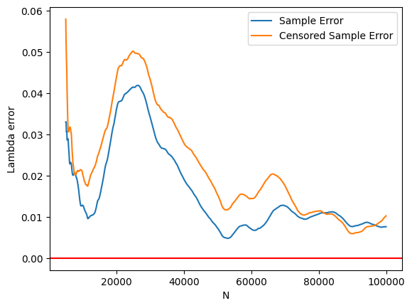

# Censura dicotomica

In questo esperimento mostriamo come, anche in presenza di censura, sia possibile fare inferenza sul parametro lambda di una distribuzione esponenziale.
Tuttavia risulta evidente dai dati empirici che la censura "rallenta" lo stimatore del parametro.

## Modello esponenziale

Sia $\underline{x} = (x_1, \dots, x_n)$ un campione estratto da $X \sim \exp(\lambda)$, con $\lambda > 0$ ignoto.
La funzione di verosimiglianza è data da

$$
L(\lambda) = \prod_{i=1}^n \lambda e^{-\lambda x_i} = \lambda^n e^{-\lambda \sum_{i=1}^n x_i} = \lambda^n e^{-\lambda n \bar{x}},
$$

e il logaritmo della funzione di verosimiglianza è
$$
\ell(\lambda) = n \log \lambda - \lambda \sum_{i=1}^n x_i = n \log \lambda - \lambda n \bar{x}.
$$
Ponendo $\ell'(\lambda) = 0$ si ottiene lo stimatore di massima verosimiglianza
$$
\hat{\lambda} = \frac{1}{\bar{x}}.
$$

Supponiamo ora che il campione $\underline{x}$ subisca una censura dicotomica. Fissato un valore $t > 0$, definiamo
$$
w_i = \begin{cases}
1 & \text{se } x_i > t \\
0 & \text{se } x_i \leq t
\end{cases}
$$

L'informazione è parziale, ma possiamo comunque fare inferenza su $\lambda$. I valori di $w_i$ sono determinazioni di una variabile aleatoria $W_i$ che segue una distribuzione di Bernoulli con probabilità di successo $p_i = P(W_i = 1) = P(X_i > t) = e^{-\lambda t}$. Lo stimatore di massima verosimiglianza di $p_i$ è $\hat{p}_i = \bar{w}_i$, e lo stimatore di massima verosimiglianza di $\lambda$ è
$$
\hat{\lambda} = \left ( -\frac{1}{t} \log \bar{w} \right )^{-1}.
$$

Tuttavia questo secondo stimatore risulta essere più "lento" del primo, come si può vedere dal seguente esperimento.

